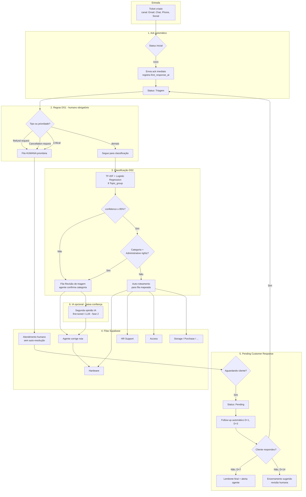
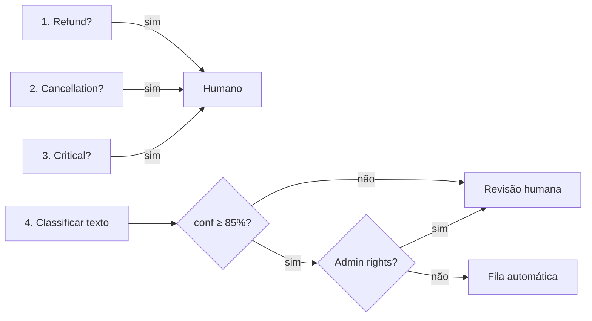

# Fluxo operacional — RotaDesk

Ticket → classificação → roteamento → humano / IA

Base: relatórios DS1 (`diagnostico/output/`) e DS2 (`automacao/ds2_metrics.json`).

---

## Visão geral

---

## Estados do ticket (Supabase)

| Status | Descrição | Origem no DS1 |
|--------|-----------|---------------|
| `open` | Criado, sem ack | Open (2.819 no baseline) |
| `triagem` | Ack enviado, aguardando classificação | — |
| `pending_review` | Conf &lt; 85% ou Admin rights | — |
| `routed` | Na fila especializada | — |
| `human_required` | Refund / Cancel / Critical | Regra DS1 |
| `pending_customer` | Aguardando cliente | Pending (2.881 no baseline) |
| `closed` | Resolvido | Closed (2.769 no baseline) |

---

## Decisões de roteamento (ordem de avaliação)

A ordem garante que **metadados DS1** (tipo/prioridade) prevalecem sobre o classificador DS2.

---

## Pontos de integração Next.js + Supabase

| Etapa | Componente | Persistência |
|-------|------------|--------------|
| Criação | API Route / Server Action | `tickets` insert |
| Ack | Edge Function + email/template | `tickets.first_response_at`, `events` |
| Classificação | API Route (modelo serializado) | `tickets.topic_group`, `confidence` |
| Router | Postgres function ou app logic | `tickets.queue_id`, `status` |
| Follow-up | Supabase cron / pg_cron | `pending_reminders` |
| Painel | Next.js dashboard | views agregadas |

---

## O que este fluxo não faz

- Não fecha ticket automaticamente em Refund/Cancellation/Critical.
- Não promete reduzir `cycle_hours` como objetivo — foco em ack, Pending e triagem.
- Não une datasets DS1 e DS2 em treino; o classificador usa apenas o artefato do DS2.

---

## Referência de volumes (baseline DS1)

Para calibrar filas e capacidade no protótipo:

- **8.469** tickets no recorte analisado.
- **67,3%** sem resolução no snapshot.
- Ack ataca os **2.819 Open**; follow-up ataca os **2.881 Pending**.
